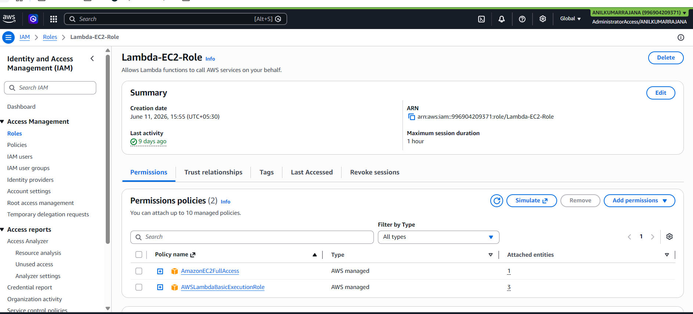
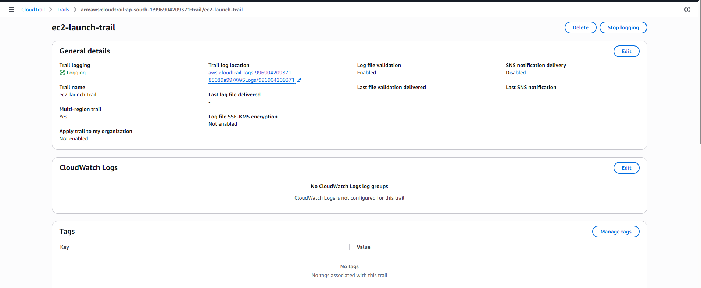
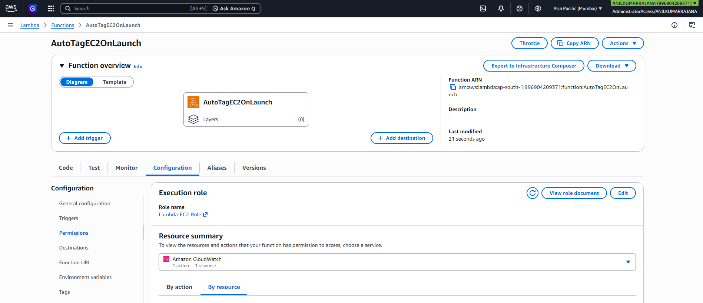
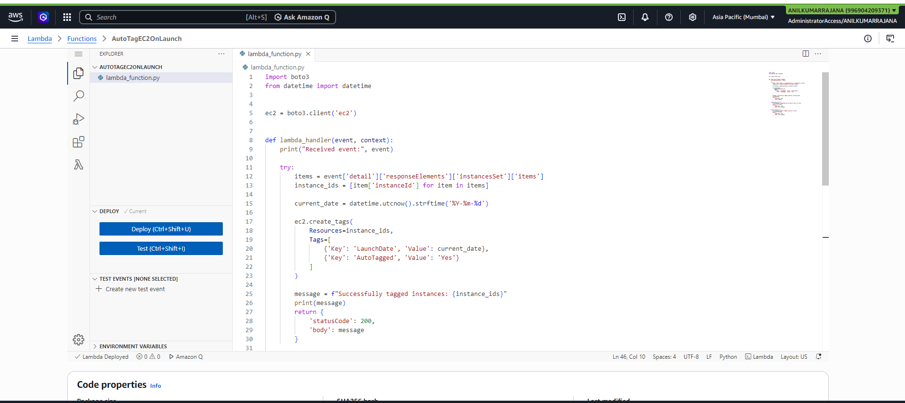
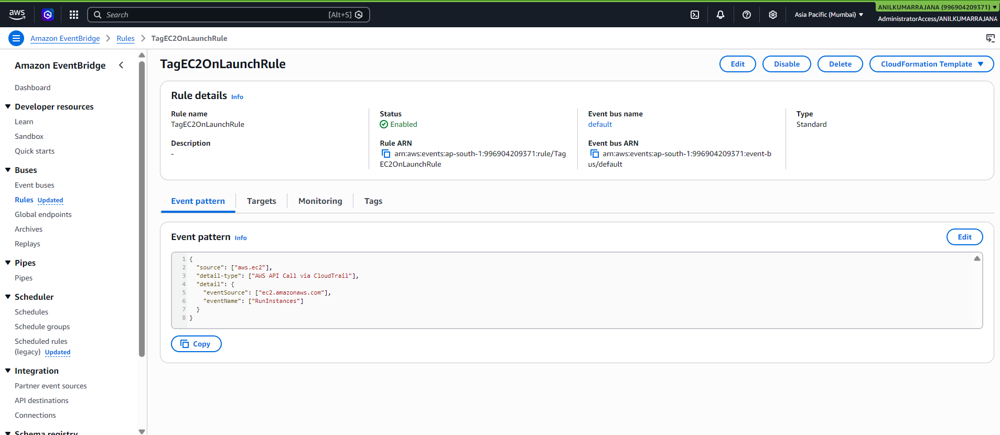
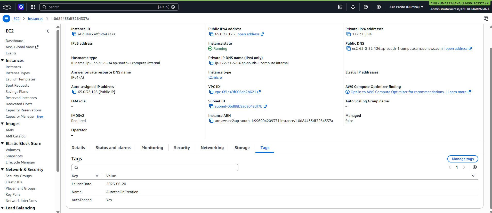
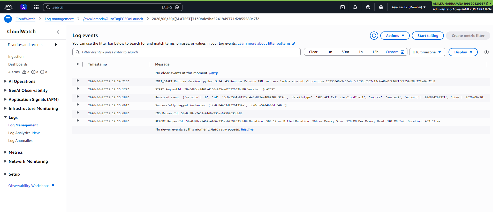

# Auto-Tagging EC2 Instances on Launch Using AWS Lambda and Boto3

This project sets up an automated workflow so every newly launched EC2 instance gets tagged with the launch date and a custom tag using Lambda, Boto3, EventBridge, and CloudTrail [1][2].

## Objective

Automatically tag any newly launched EC2 instance with:
- the current date
- one custom tag such as `AutoTagged=Yes`

The automation is event-driven: an EC2 launch API call is captured through CloudTrail, matched by an EventBridge rule, and sent to a Lambda function that calls the EC2 `create_tags` API through Boto3 [1][2].

## Architecture

1. A user or service launches an EC2 instance.
2. CloudTrail records the `RunInstances` API call.
3. EventBridge matches that API activity with a rule using the default event bus [2][1].
4. EventBridge invokes the Lambda function.
5. The Lambda function extracts the new instance ID from the event payload and applies tags using `ec2.create_tags()` [2].
6. CloudWatch Logs stores the Lambda execution logs for verification [1].

## Prerequisites

Before starting, make sure the following are available:

- An AWS account with permission to use EC2, IAM, Lambda, EventBridge, CloudTrail, and CloudWatch.
- Permission to launch EC2 instances.
- A CloudTrail trail in the same region, or permission to create one, because EventBridge can react to AWS API calls that are recorded by CloudTrail [1].
- Basic familiarity with the AWS Management Console.


## Step 1: Create the IAM role for Lambda
Create an IAM role for lamda as Lambda-EC2-Role with the below policies.
**AmazonEC2FullAccess** [To lambda execution]
**AWSLambdaBasicExecutionRole** [To write logs to cloudwatch logs]



## Step 2: Create CloudTrail
EventBridge can use API-call-based rules only when those AWS API calls are recorded by CloudTrail.

Create a trail as `ec2-launch-trail` with default values and AWS to create s3 for storage.



## Step 3: Create the Lambda function

Create a Lambda Function as `AutoTagEC2OnLaunch` with an existing role`Lambda-EC2-Role`.



## Step 4: Add the Python Boto3 code

Replace the default Lambda code with the following script.

```python
import boto3
from datetime import datetime


ec2 = boto3.client('ec2')


def lambda_handler(event, context):
    print("Received event:", event)

    try:
        items = event['detail']['responseElements']['instancesSet']['items']
        instance_ids = [item['instanceId'] for item in items]

        current_date = datetime.utcnow().strftime('%Y-%m-%d')

        ec2.create_tags(
            Resources=instance_ids,
            Tags=[
                {'Key': 'LaunchDate', 'Value': current_date},
                {'Key': 'AutoTagged', 'Value': 'Yes'}
            ]
        )

        message = f"Successfully tagged instances: {instance_ids}"
        print(message)
        return {
            'statusCode': 200,
            'body': message
        }

    except KeyError as e:
        error_message = f"Expected key not found in event: {str(e)}"
        print(error_message)
        return {
            'statusCode': 400,
            'body': error_message
        }

    except Exception as e:
        error_message = f"Error tagging instance: {str(e)}"
        print(error_message)
        return {
            'statusCode': 500,
            'body': error_message
        }
```

### What this script does

- It initializes an EC2 client using Boto3.
- It reads the instance IDs from the `RunInstances` event payload.
- It creates two tags: `LaunchDate` and `AutoTagged`.
- It prints a success message that appears in CloudWatch Logs.
- It uses the EC2 `create_tags` API, which adds or overwrites only the specified tags for the target resources [2].

### Why `datetime.utcnow()` is used

The assignment asks for the current date. Lambda commonly uses UTC when generating timestamps, so the tag value will reflect the UTC date unless you explicitly convert time zones.

### Example tags created

| Tag Key | Example Value | Purpose |
|---|---|---|
| `LaunchDate` | `2026-06-20` | Tracks when the automation tagged the instance |
| `AutoTagged` | `Yes` | Identifies that the instance was tagged automatically |

Deploy the lambda with updated code.



## Step 5: Create the EventBridge rule

Create a rule that reacts to the EC2 launch API call recorded by CloudTrail. AWS documents this pattern for API-call-driven EventBridge rules, where the rule type is based on an event pattern and the target can be a Lambda function [1].

Create a rule in Event bridge as `TagEC2OnLaunchRule` with source as AWS Services and Target as  `AutoTagEC2OnLaunch` lambda Function.

This pattern targets EC2 API calls coming from CloudTrail and narrows them to the `RunInstances` action, which is the API invoked when a new EC2 instance is launched.

AWS automatically adds permission so EventBridge can invoke the target Lambda function when you attach the function through the console [1].



## Step 6: Understand the event payload

When the rule matches a `RunInstances` API call, Lambda receives an event that includes the CloudTrail API response. The instance IDs are typically present under this path:

```text
 event['detail']['responseElements']['instancesSet']['items']
```

Each item in that list contains an `instanceId`, which the function uses as the resource ID for `create_tags()`.

## Step 7: Test the automation

1. Launch a new EC2 instance in the same region where the rule and Lambda function were created.
2. Wait for one to three minutes.
3. Open the instance details page.
4. Go to the **Tags** tab.
5. Confirm that the tags were added automatically.

### Expected result

You should see tags similar to:

| Key | Value |
|---|---|
| `LaunchDate` | Current UTC date |
| `AutoTagged` | `Yes` |



## Step 8: Verify in CloudWatch Logs

AWS recommends using CloudWatch Logs to confirm that the Lambda function executed successfully after the EventBridge rule fired [1].

Validate the output in cloudwatch -> logs -> Log groups.



## Cleanup

To avoid charges after testing:

1. Terminate the test EC2 instance.
2. Disable or delete the EventBridge rule.
3. Delete the Lambda function if no longer needed.
4. Delete the CloudTrail trail only if it was created solely for this lab and is not needed elsewhere [1].

## Files in this project

- `lambda_function.py`  
  - Contains the Lambda handler and Boto3 logic to delete S3 objects older than the configured number of days.
- `README.md`  
  - This documentation.
- `Images`
  - Screenshots

## Author

```bash 
Anil Kumar Rajana
```
