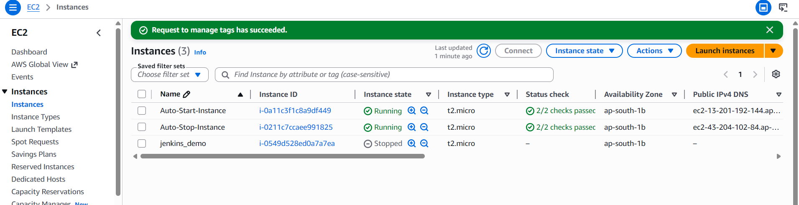
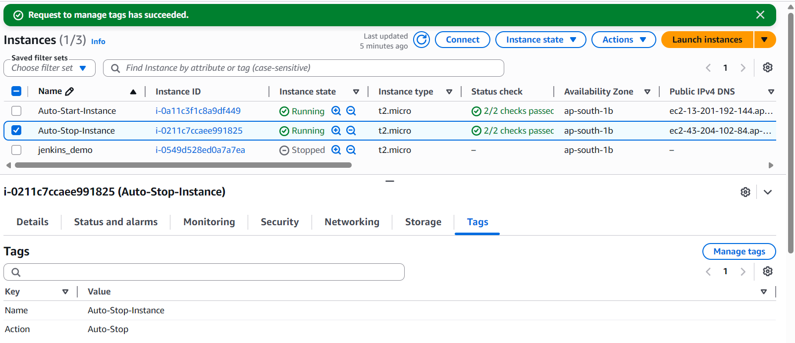
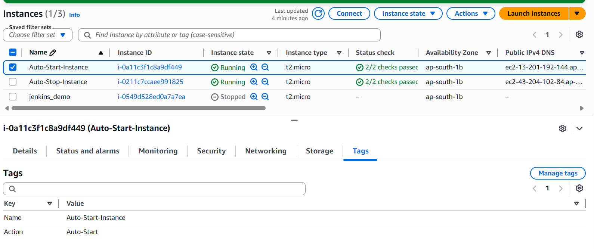
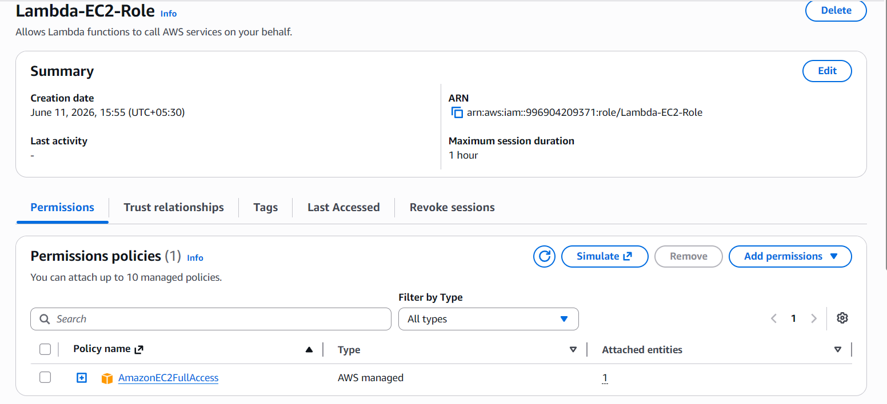
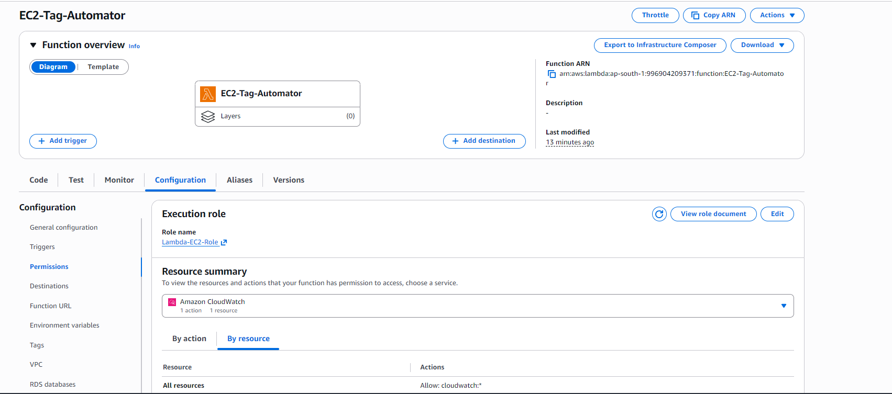
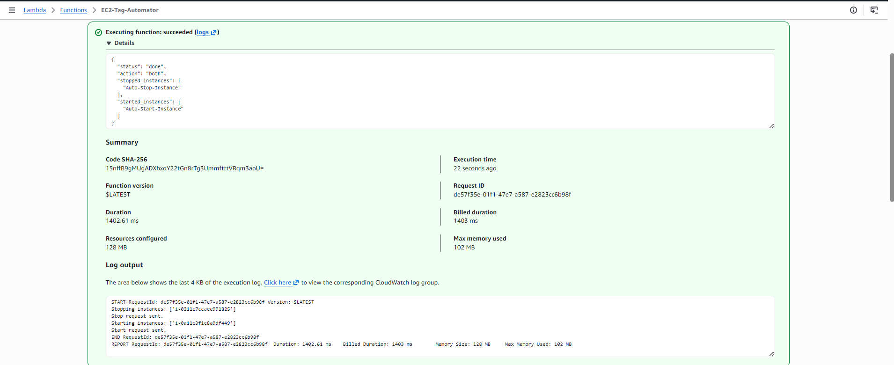
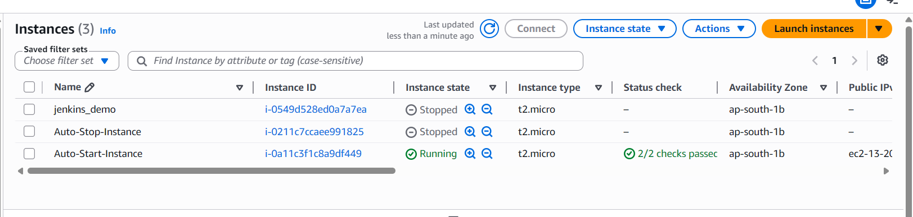

# Automated Instance Management Using AWS Lambda and Boto3

## Objective: 
In this Project, you will gain hands-on experience with AWS Lambda and Boto3, Amazon's SDK for Python. You will create a Lambda function that will automatically manage EC2 instances based on their tags.

Automate the stopping and starting of EC2 instances based on tags.

### 1. Setup:

   - Create two EC2 instances.

   - Tag one of them as `Auto-Stop` and the other as `Auto-Start`.

### 2. Lambda Function Creation:

   - Set up an AWS Lambda function.

   - Ensure that the Lambda function has the necessary IAM permissions to describe, stop, and start EC2 instances.

### 3. Coding:

   - Using Boto3 in the Lambda function:

     - Detect all EC2 instances with the `Auto-Stop` tag and stop them.

     - Detect all EC2 instances with the `Auto-Start` tag and start them.

### 4. Testing:

   - Manually invoke the Lambda function.

   - Confirm that the instance tagged `Auto-Stop` stops and the one tagged `Auto-Start` starts.

# Implementation:

### 1. EC2 Setup:

   - create two new t2.micro instances (or any other available free-tier type).
   
  

   - Tag the first instance with a key `Action` and value `Auto-Stop`.
   
   
    
   - Tag the second instance with a key `Action` and value `Auto-Start`.
   
   
   
### 2. Lambda IAM Role:

   -create a new role for Lambda.

   - Attach the `AmazonEC2FullAccess` policy to this role.
   
   
   
### 3. Lambda Function:

   -Create a lambda function by assigning  the IAM role created in the previous step.
   
   
    
   **- Write the Boto3 Python script:**

         ```python
         import os
         import boto3
         
         REGION = os.environ.get("AWS_REGION", "ap-south-1")
         
         ec2 = boto3.client("ec2", region_name=REGION)
         
         def get_instances_by_tag(tag_key, tag_value, state=None):
             filters = [
                 {"Name": f"tag:{tag_key}", "Values": [tag_value]},
             ]
             if state:
                 filters.append({"Name": "instance-state-name", "Values": [state]})
         
             response = ec2.describe_instances(Filters=filters)
             instances = []
             for reservation in response.get("Reservations", []):
                 for instance in reservation.get("Instances", []):
                     name = next(
                         (tag["Value"] for tag in instance.get("Tags", []) if tag["Key"] == "Name"),
                         instance["InstanceId"],
                     )
                     instances.append({"InstanceId": instance["InstanceId"], "Name": name})
             return instances
         
         def start_tagged_instances():
             instances = get_instances_by_tag("Action", "Auto-Start", state="stopped")
             if not instances:
                 print("No stopped instances found with tag Action=Auto-Start")
                 return []
         
             instance_ids = [instance["InstanceId"] for instance in instances]
             print("Starting instances:", instance_ids)
             ec2.start_instances(InstanceIds=instance_ids)
             print("Start request sent.")
             return instances
         
         def stop_tagged_instances():
             instances = get_instances_by_tag("Action", "Auto-Stop", state="running")
             if not instances:
                 print("No running instances found with tag Action=Auto-Stop")
                 return []
         
             instance_ids = [instance["InstanceId"] for instance in instances]
             print("Stopping instances:", instance_ids)
             ec2.stop_instances(InstanceIds=instance_ids)
             print("Stop request sent.")
             return instances
         
         def lambda_handler(event, context):
             action = event.get("action", "both")
             result = {"status": "done", "action": action}
         
             if action == "start":
                 started = start_tagged_instances()
                 result["started_instances"] = [instance["Name"] for instance in started]
             elif action == "stop":
                 stopped = stop_tagged_instances()
                 result["stopped_instances"] = [instance["Name"] for instance in stopped]
             else:
                 stopped = stop_tagged_instances()
                 started = start_tagged_instances()
                 result["stopped_instances"] = [instance["Name"] for instance in stopped]
                 result["started_instances"] = [instance["Name"] for instance in started]
         
             return result
         ```

     
   

### 4. Validation:

   - After deploying the function, confirm that the instances' states have changed according to their tags.
   
   
