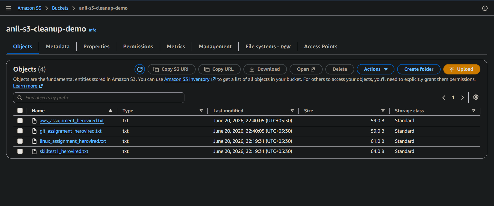
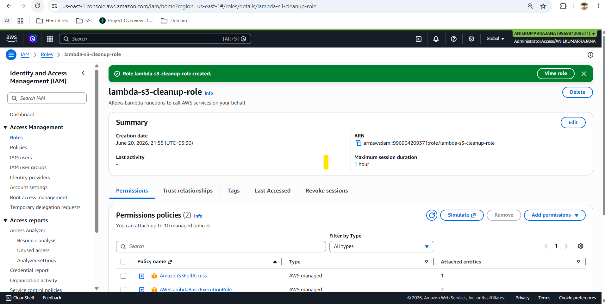
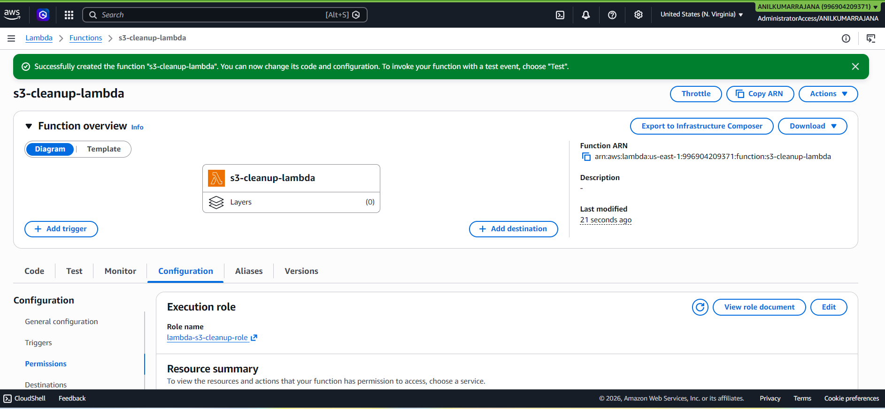
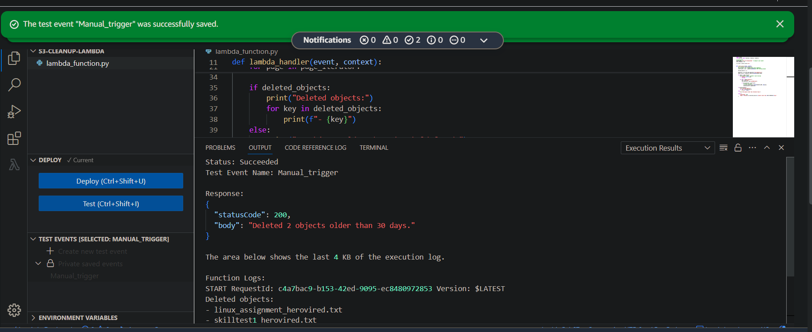
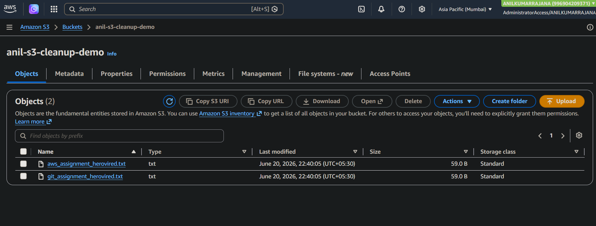

# Automated S3 Bucket Cleanup Using AWS Lambda and Boto3

## Overview

This project implements an AWS Lambda function written in Python that automatically deletes objects older than 30 days from a specified Amazon S3 bucket. It uses the AWS SDK for Python (Boto3) to list objects, compare their age, and remove outdated files, while logging all deletions to Amazon CloudWatch Logs. [web:11][web:13]

This assignment demonstrates how to combine S3, Lambda, IAM roles, and Boto3 to perform basic housekeeping tasks on cloud storage.

## Architecture

- **Amazon S3**  
  - Stores files in a single bucket (e.g. `anil-s3-cleanup-demo`).
- **AWS Lambda (Python 3.x)**  
  - Executes a cleanup function on demand (manual test) or on a schedule (optional EventBridge rule).
- **IAM Role**  
  - Lambda execution role with `AmazonS3FullAccess` and `AWSLambdaBasicExecutionRole` policies.
- **CloudWatch Logs**  
  - Stores log output, including the names of deleted objects.

## Prerequisites

- AWS account with console access.
- Permissions to create:
  - S3 buckets and upload objects.
  - IAM roles and attach managed policies.
  - Lambda functions.
- Basic knowledge of Python and Boto3.

## Setup Steps

### 1. Create and populate the S3 bucket

1. Create a S3bucket and use an unique name(anil-s3-cleanup-demo) for it.
2. Upload the files now and 20 mins before as old into the s3 bucket.



### 2. Create the Lambda execution role

1. Create a IAM role and Attach the following managed policies:
   - `AmazonS3FullAccess`
   - `AWSLambdaBasicExecutionRole` (For cloudwatch logs)
2. Name the role (e.g. `lambda-s3-cleanup-role`) and create it.

> Note: `AmazonS3FullAccess` is used for simplicity in this assignment. In production, prefer a least‑privilege policy restricted to the specific bucket and required actions only. [web:11]



### 3. Create the Lambda function

1. Create the lambda function with exixting execution role `lambda-s3-cleanup-role`.



### 4. Add the cleanup code

1. In the code block add the code for s3 cleanup for 30 days before.

    ```python
    import boto3
    from datetime import datetime, timezone, timedelta

    # Configuration
    BUCKET_NAME = "anil-s3-cleanup-demo"  # change to your bucket
    DAYS_THRESHOLD = 30

    s3_client = boto3.client("s3")


    def lambda_handler(event, context):
        now = datetime.now(timezone.utc)
        #cutoff_date = now - timedelta(days=DAYS_THRESHOLD)
        cutoff_date = now - timedelta(minutes=15) #For testing purpose

        deleted_objects = []

        paginator = s3_client.get_paginator("list_objects_v2")
        page_iterator = paginator.paginate(Bucket=BUCKET_NAME)

        for page in page_iterator:
            # If bucket is empty, 'Contents' may be missing
            if "Contents" not in page:
                continue

            for obj in page["Contents"]:
                key = obj["Key"]
                last_modified = obj["LastModified"]

                if last_modified < cutoff_date:
                    # delete the object
                    s3_client.delete_object(Bucket=BUCKET_NAME, Key=key)
                    deleted_objects.append(key)

        if deleted_objects:
            print("Deleted objects:")
            for key in deleted_objects:
                print(f"- {key}")
        else:
            print("No objects older than threshold found.")

        return {
            "statusCode": 200,
            "body": f"Deleted {len(deleted_objects)} objects older than {DAYS_THRESHOLD} days."
        }
    ```

2. For testing purpose have used 15 minuets threshold and deploy the code.

    ```python
    cutoff_date = now - timedelta(minutes=15) #For testing purpose
    ```

### 5. Manual testing

1. In the Lambda console, go to the **Test** tab.  
2. Create a new test event with any dummy JSON.  
3. Click **Test** to invoke the function manually.  
4. Verify the result:
   - The function response should show how many objects were deleted.  
   - In **CloudWatch Logs**, confirm the list of deleted object keys.  
   - In the S3 bucket, confirm that:
     - “Old” files are deleted.  
     - “New” files remain in place.





## Files in this project

- `lambda_function.py`  
  - Contains the Lambda handler and Boto3 logic to delete S3 objects older than the configured number of days.
- `README.md`  
  - This documentation.
