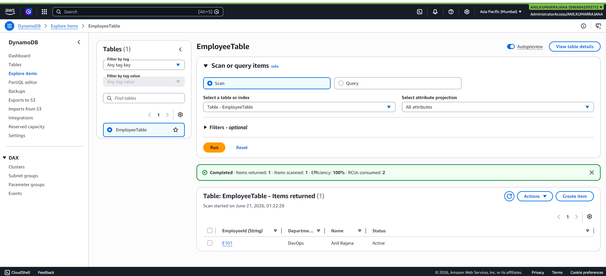
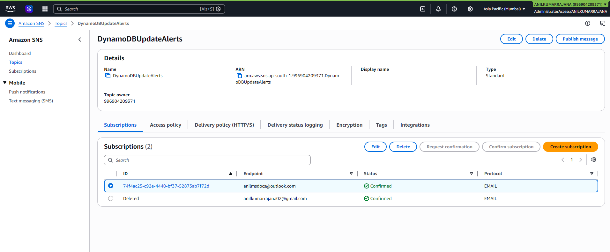
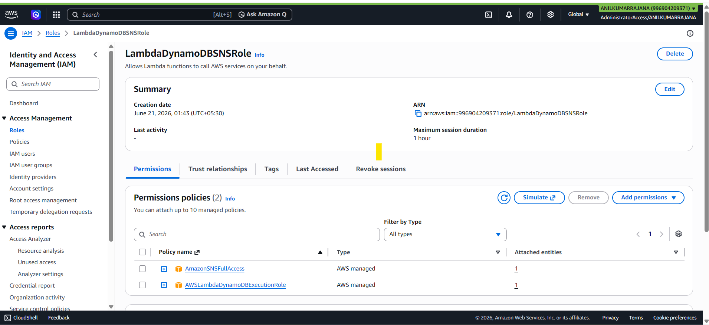
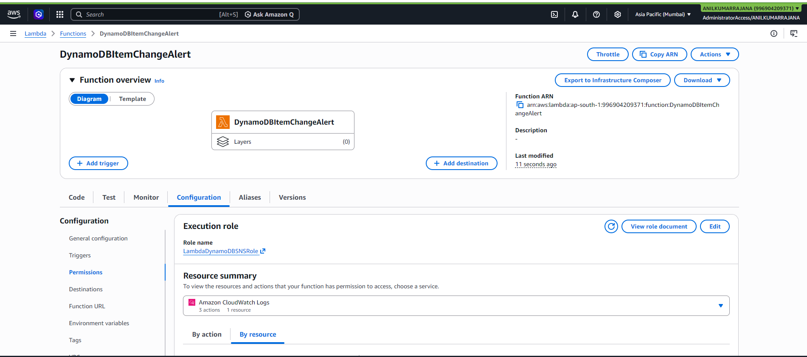
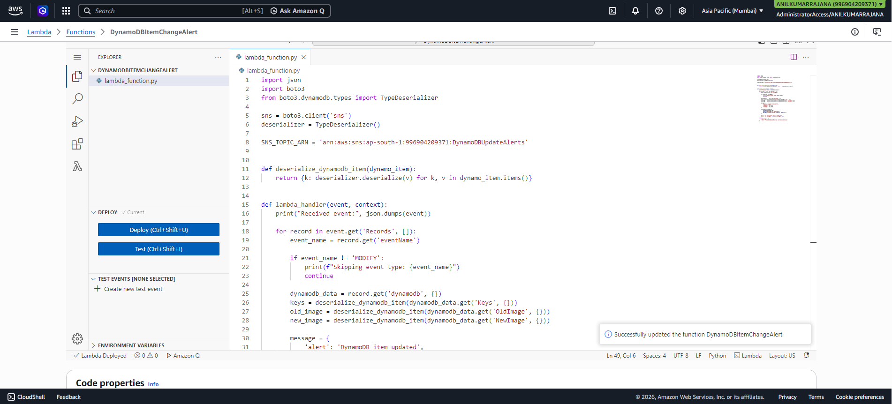
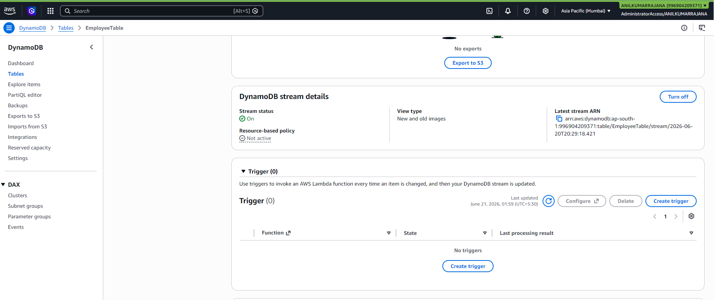
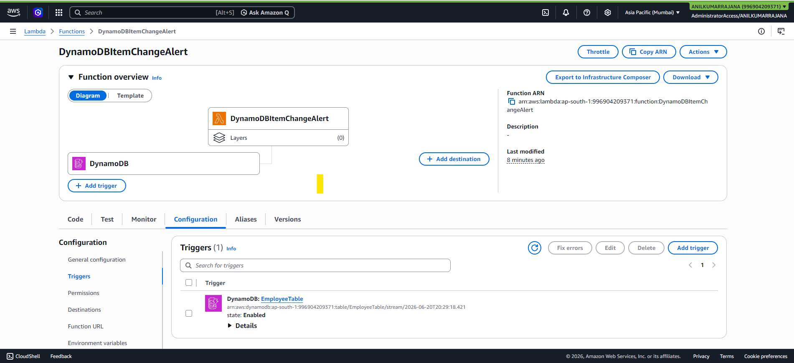
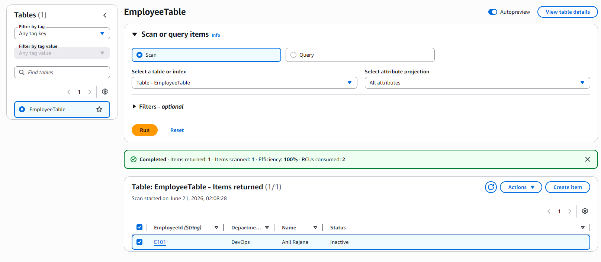
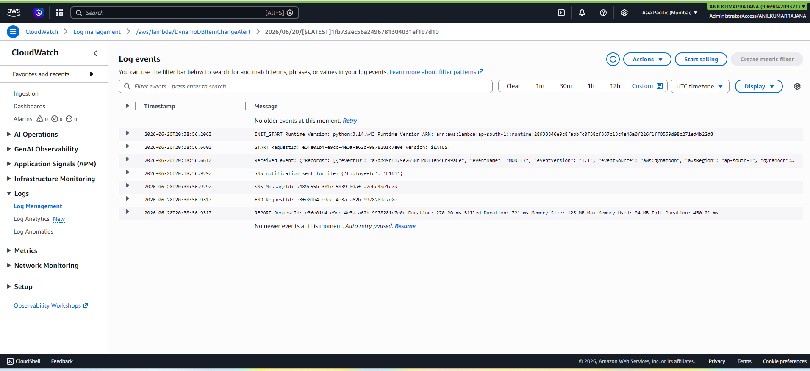
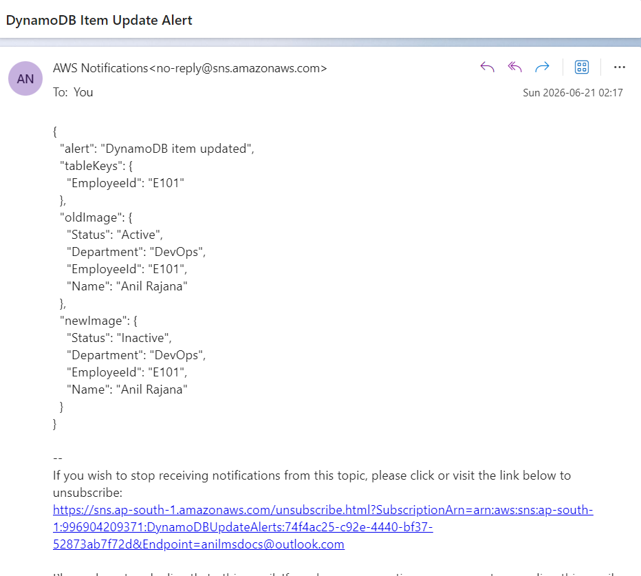

# DynamoDB Item Change Alert Using AWS Lambda, Boto3, and SNS

This Project creates an automated alerting workflow where a Lambda function is triggered by DynamoDB Streams whenever an item is updated, and the function sends an SNS notification that describes the change [1][2].

## Objective

Receive an alert whenever an item in a DynamoDB table is updated by connecting these AWS services:

- Amazon DynamoDB
- DynamoDB Streams
- AWS Lambda
- Amazon SNS
- IAM
- Amazon CloudWatch Logs

DynamoDB Streams captures item-level modifications in near real time, and when the stream is enabled with **New and old images**, the event contains both the item state before the update and after the update [1].

## Architecture

1. A DynamoDB item is updated.
2. DynamoDB Streams records the change.
3. The stream record contains the old and new item images when the table stream uses `NEW_AND_OLD_IMAGES` [1].
4. Lambda polls the DynamoDB stream through an event source mapping and invokes the function with the stream event [2].
5. The Lambda function extracts the modified item details.
6. The Lambda function publishes a message to an SNS topic using Boto3 `sns.publish()` [3].
7. SNS sends the alert to the subscribed email address.
8. CloudWatch Logs stores the Lambda execution logs for tracking and troubleshooting [2].

## Prerequisites

Make sure you have:

- An AWS account with access to DynamoDB, Lambda, SNS, IAM, and CloudWatch.
- Permission to create DynamoDB tables and update items.
- A valid email address for SNS subscription.
- Basic console access in the same AWS region for all resources.

## Step 1: Create the DynamoDB table

Create a table name such as `EmployeeTable` and items into the table as 
`EmployeeId` | `Name` | `Department` | `Status`




## Step 2: Create the SNS topic

Create a topic as `DynamoDBUpdateAlerts` and create a Email Subscription for alerting for **anilmsdocs@outlook.com**




## Step 3: Create the IAM role for Lambda

Create an IAM role as `LambdaDynamoDBSNSRole`to enble execution acces to dynamodb and SNS for lambda by allowing below policies.

**AWSLambdaDynamoDBExecutionRole**.
**AmazonSNSFullAccess**



## Step 4: Create the Lambda function

Create a lambda function as `DynamoDBItemChangeAlert` with the role created earlier `LambdaDynamoDBSNSRole` as permissions.



## Step 5: Add the Python code

Replace the default code with the script below.

```python
import json
import boto3
from boto3.dynamodb.types import TypeDeserializer

sns = boto3.client('sns')
deserializer = TypeDeserializer()

SNS_TOPIC_ARN = 'arn:aws:sns:ap-south-1:996904209371:DynamoDBUpdateAlerts'


def deserialize_dynamodb_item(dynamo_item):
    return {k: deserializer.deserialize(v) for k, v in dynamo_item.items()}


def lambda_handler(event, context):
    print("Received event:", json.dumps(event))

    for record in event.get('Records', []):
        event_name = record.get('eventName')

        if event_name != 'MODIFY':
            print(f"Skipping event type: {event_name}")
            continue

        dynamodb_data = record.get('dynamodb', {})
        keys = deserialize_dynamodb_item(dynamodb_data.get('Keys', {}))
        old_image = deserialize_dynamodb_item(dynamodb_data.get('OldImage', {}))
        new_image = deserialize_dynamodb_item(dynamodb_data.get('NewImage', {}))

        message = {
            'alert': 'DynamoDB item updated',
            'tableKeys': keys,
            'oldImage': old_image,
            'newImage': new_image
        }

        response = sns.publish(
            TopicArn=SNS_TOPIC_ARN,
            Subject='DynamoDB Item Update Alert',
            Message=json.dumps(message, indent=2, default=str)
        )

        print(f"SNS notification sent for item {keys}")
        print(f"SNS MessageId: {response['MessageId']}")

    return {
        'statusCode': 200,
        'body': 'Processed DynamoDB stream records successfully.'
    }
```

## Code explanation

- `TypeDeserializer` converts DynamoDB stream attribute formats like `{"S":"value"}` into normal Python values.
- The function loops through `Records` from the stream event.
- It processes only `MODIFY` events so that alerts are sent only for updates, not inserts or deletes.
- It reads `Keys`, `OldImage`, and `NewImage` from the stream record.
- It sends the formatted change details to SNS using `sns.publish()` [3].
- It logs the result to CloudWatch Logs for verification [2].



## Step 6: Enable DynamoDB Streams

AWS explains that a stream can be enabled from the **Exports and streams** tab, and **New and old images** records both versions of the modified item .

Turn on Dynamodb stream for the create table For `EmployeeTable` and view Type as **New and old images**.




## Step 7: Attach Lambda to the DynamoDB Stream

AWS Lambda uses an event source mapping to associate a DynamoDB stream with a function, after which Lambda starts polling the stream [2].

### Console steps

Create a **trigger** in Lambda function `DynamoDBItemChangeAlert` with **DynamoDB** as source.




## Step 8: Test the end-to-end flow

Edit the values in dynamo db table then lambda function will trigger and send an SNS Notifitcation.

**Attaching Modified Table in DynamoDB**


**Attaching cloud watch logs for successfull trigger of Lambda and SNS**


**Attaching Mail Notification Received to SNS Subscribed EMail**


## Files in this project

- `lambda_function.py`  
  - Contains the Lambda handler and Boto3 logic to delete S3 objects older than the configured number of days.
- `README.md`  
  - This documentation.
- `Images`
  - Screenshots

## Screenshots Included
  **- dynamo db and table creation**
  **- SNS topic and subscription creation**
  **- IAM ROle**
  **- Lambda Function Creation**
  **- Lambda Code Deploy**
  **- dynamodb stream Creartion**
  **- Adding Trigger in lambda for DynamoDB**
  **- MOdified Table values inside dynamodb**
  **- Output - Email notification Received through Email**
  **- Output - CloudWatch Logs**

## Cleanup

To avoid unnecessary charges after submission:

1. Delete or disable the Lambda trigger.
2. Delete the Lambda function.
3. Delete the SNS topic and subscription.
4. Delete the DynamoDB table if it was created only for the assignment.

## Author

```bash
**Anil Kumar Rajana** 
```
