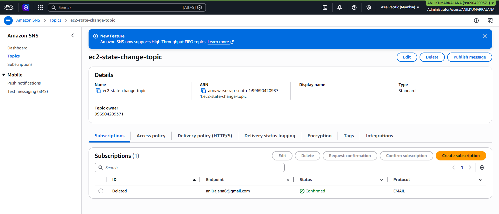
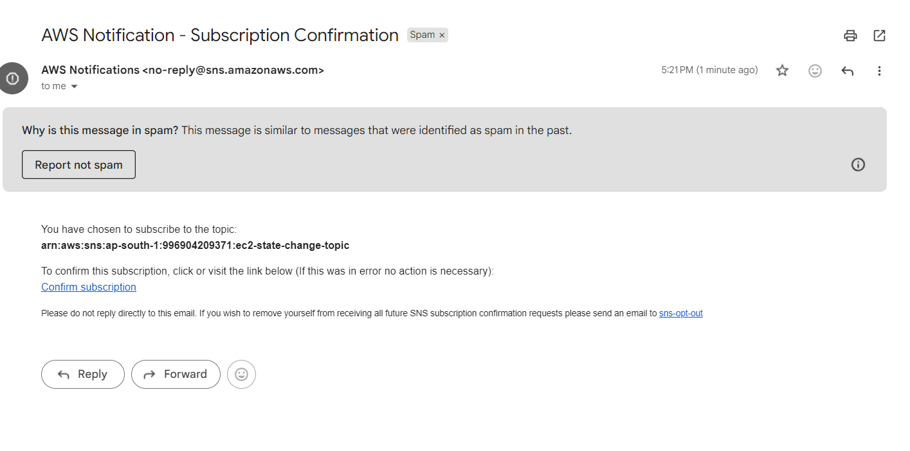
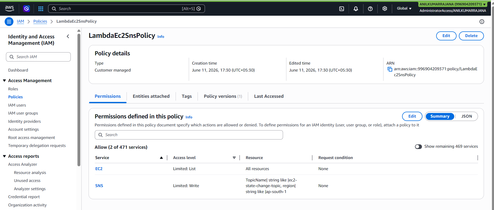
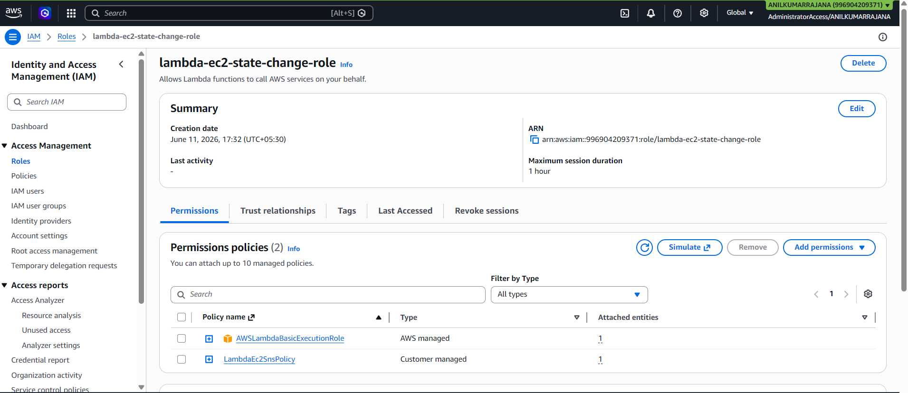
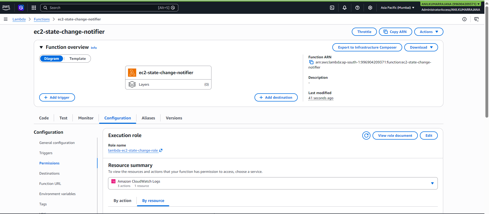
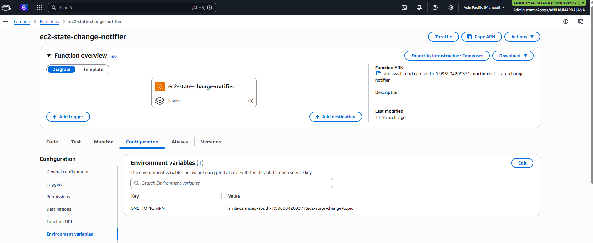
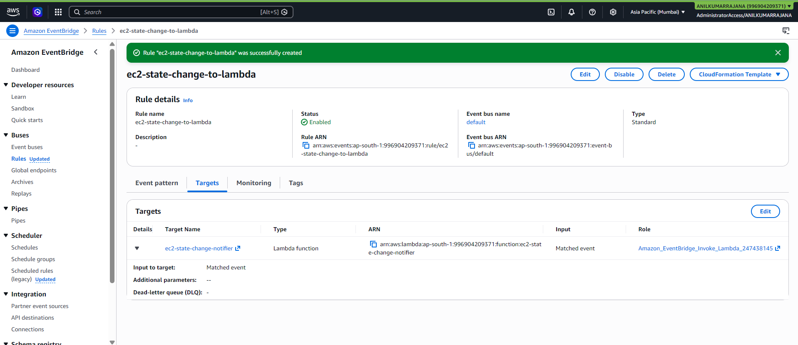
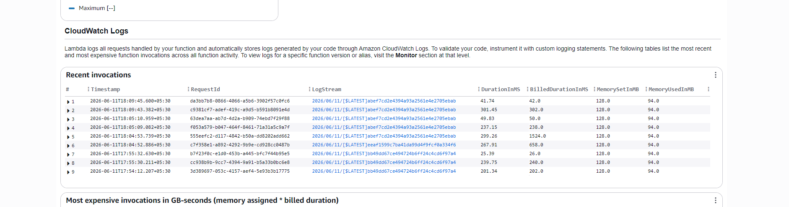

# EC2 Instance State Change Notifications with Lambda, EventBridge, and SNS

## Objective

Automatically monitor EC2 instance state changes (start/stop) and send email notifications using Amazon EventBridge, AWS Lambda (Python/Boto3), and Amazon SNS.

## Architecture

- **EventBridge Rule**: Listens for `EC2 Instance State-change Notification` events.
- **Lambda Function**: Triggered by EventBridge, parses the event, and publishes a message to SNS.
- **SNS Topic**: Sends email notifications to subscribed endpoints (email).

## Prerequisites

- AWS account with access to EC2, Lambda, EventBridge, SNS, and IAM.
- At least one EC2 instance running in the target region.
- Python runtime selected for Lambda (e.g., Python 3.11).

## Step 1: Create SNS Topic and Email Subscription

1. Open the SNS console and create a **Standard** topic named `ec2-state-change-topic`.
2. Note the **Topic ARN** for later use.
3. Create a **subscription** to the topic:
   - Protocol: Email  
   - Endpoint: your email address  
4. Confirm the subscription from the received confirmation email.

    **SNS Topic and subscription creation**
    

    **Confirmation Email**
    

## Step 2: Create IAM Role for Lambda

1. Open the IAM console and create a new **role** for **Lambda**.
2. Attach:
   - Custom policy that allows:
     - `ec2:DescribeInstances` on `*`.
     - `sns:Publish` on the SNS topic ARN.

    

   - `AWSLambdaBasicExecutionRole` for CloudWatch logging.
3. Name the role `lambda-ec2-state-change-role`.

    

## Step 3: Create Lambda Function

1. In the Lambda console, create a function:
   - Name: `ec2-state-change-notifier`
   - Runtime: Python 3.x
   - Execution role: `lambda-ec2-state-change-role`

   

2. Add an environment variable:
   - `SNS_TOPIC_ARN` = ARN of `ec2-state-change-topic`.

   

3. Replace the function code with:

   ```python
   import os
   import json
   import boto3

   sns_client = boto3.client('sns')

   SNS_TOPIC_ARN = os.environ.get('SNS_TOPIC_ARN')

   def lambda_handler(event, context):
       print("Received event:", json.dumps(event))

       detail = event.get("detail", {})
       instance_id = detail.get("instance-id", "Unknown")
       state = detail.get("state", "Unknown")

       subject = f"EC2 instance {instance_id} state changed to {state}"
       message = (
           f"An EC2 instance has changed state.\n\n"
           f"Instance ID: {instance_id}\n"
           f"New State: {state}\n"
           f"Region: {event.get('region', 'Unknown')}\n"
           f"Event Time: {event.get('time', 'Unknown')}\n"
           f"Detail Type: {event.get('detail-type', 'Unknown')}"
       )

       response = sns_client.publish(
           TopicArn=SNS_TOPIC_ARN,
           Subject=subject,
           Message=message
       )

       print("SNS publish response:", response)
       return {"statusCode": 200, "body": "Notification sent"}
   ```

4. Deploy the function.

## Step 4: Create EventBridge Rule

1. Open the EventBridge console and create a rule named `ec2-state-change-to-lambda`.
2. Event bus: `default`.
3. Rule type: **Event pattern**.
4. Set **Target** to the `ec2-state-change-notifier` Lambda function.
5. Enable the rule.

    

## Step 5: Test the Setup

1. Ensure your email subscription to the SNS topic is confirmed.
2. In the EC2 console, start or stop an instance in the same region.
3. Verify:
   - Lambda logs show an invocation and successful SNS publish.
   - You receive an email notification with the instance ID and new state.
    