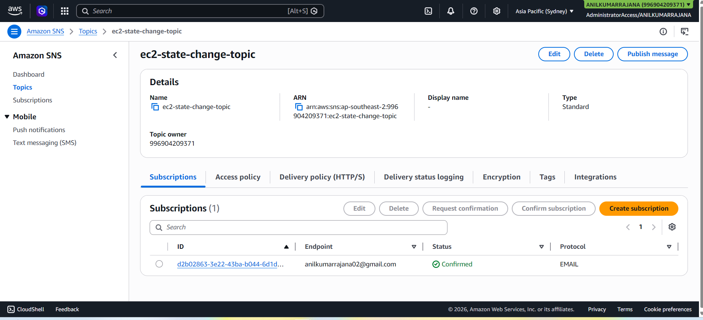
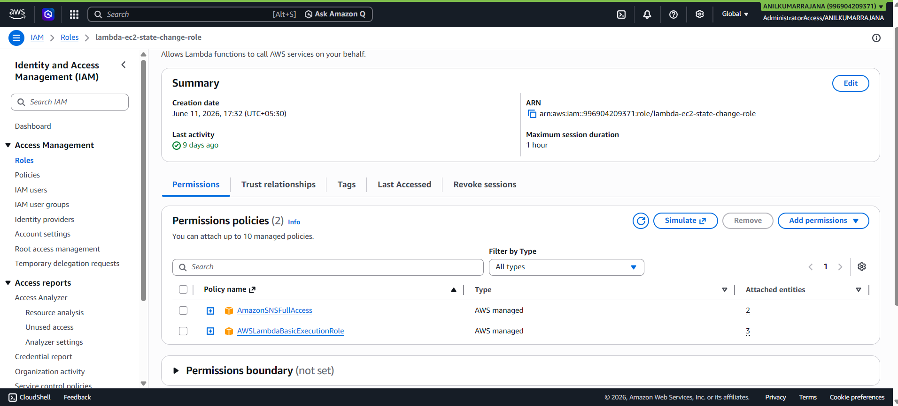
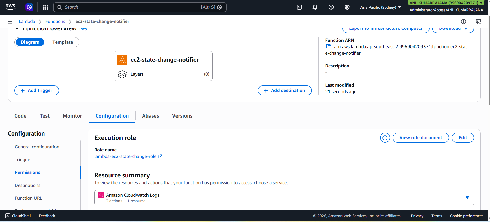
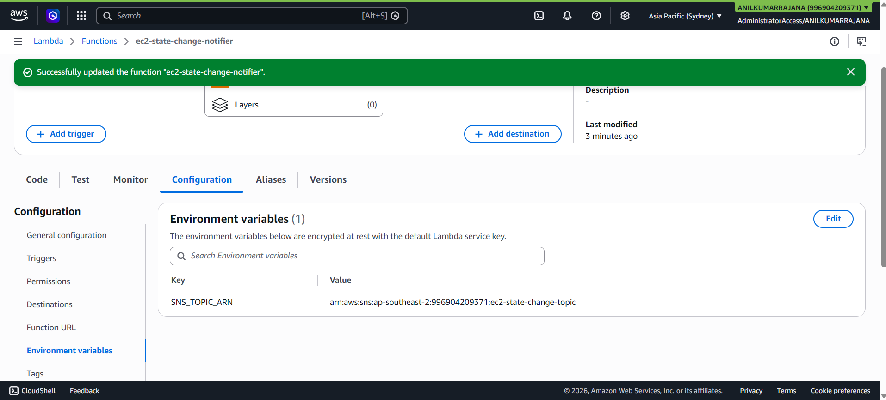
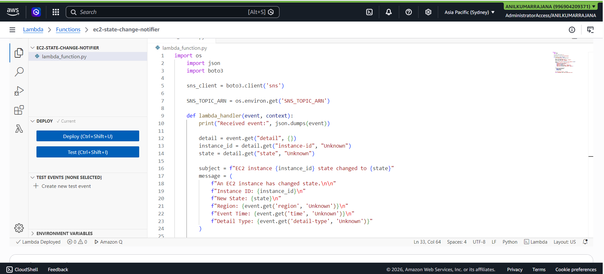
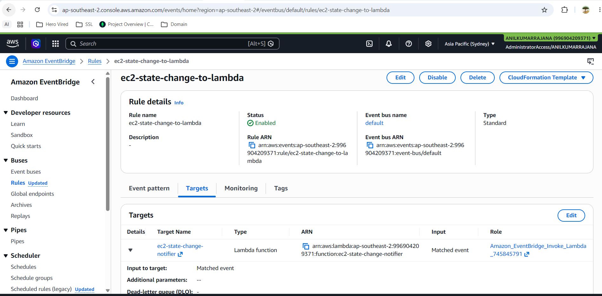
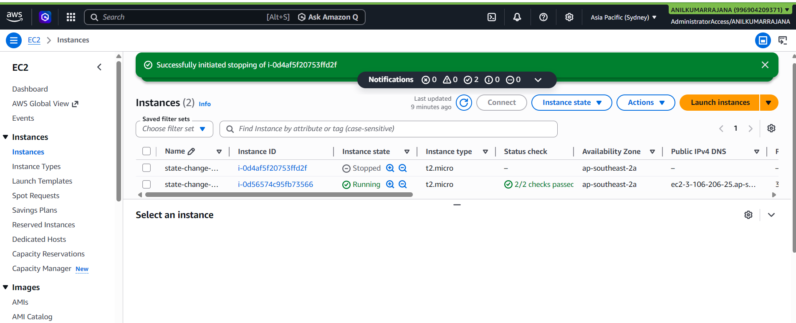
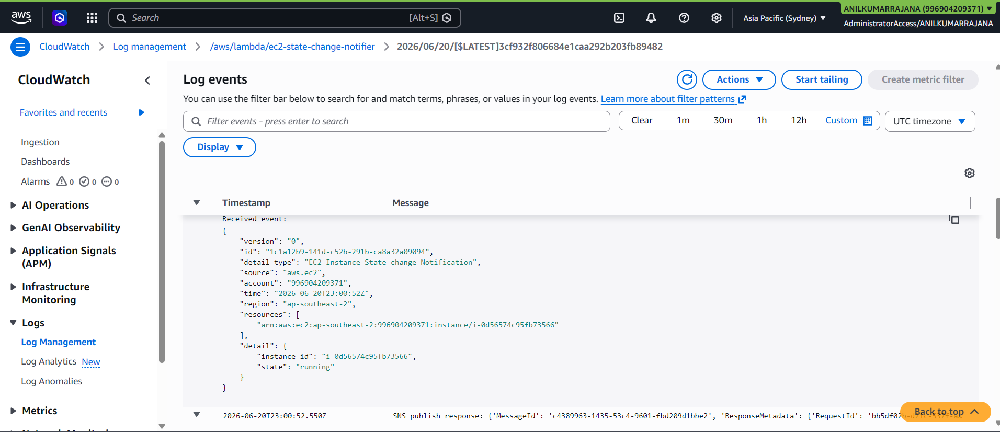
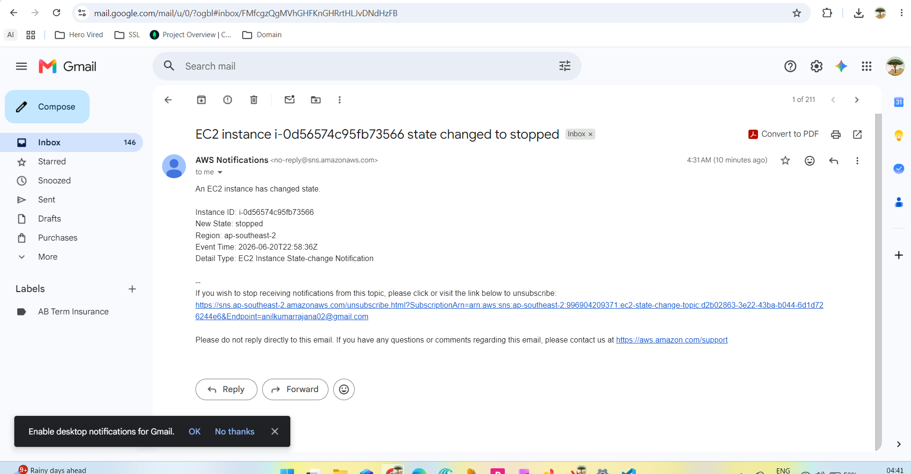
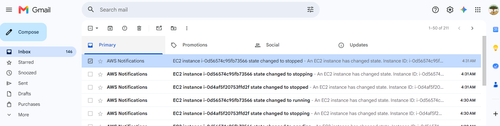

# EC2 Instance State Change Notifications with Lambda, EventBridge, and SNS

## Objective

Automatically monitor EC2 instance state changes (start/stop) and send email notifications using Amazon EventBridge, AWS Lambda (Python/Boto3), and Amazon SNS.

## Architecture

- **EventBridge Rule**: Listens for `EC2 Instance State-change Notification` events.
- **Lambda Function**: Triggered by EventBridge, parses the event, and publishes a message to SNS.
- **SNS Topic**: Sends email notifications to subscribed endpoints (email).

## Prerequisites

- AWS account with access to EC2, Lambda, EventBridge, SNS, and IAM.
- At least one EC2 instance running in the target region.
- Python runtime selected for Lambda (e.g., Python 3.11).

## Step 1: Create SNS Topic and Email Subscription

Create a SNS Topis as `ec2-state-change-topic` and create an EMail subscrition for **anilkumarrajana02@gmail.com** .

    **SNS Topic and subscription creation**
    


## Step 2: Create IAM Role for Lambda

Create an IAM Role for Lambda as `lambda-ec2-state-change-role`to allow below policies

**- AWSLambdaBasicExecutionRole**
**- AmazonSNSFullAccess**



## Step 3: Create Lambda Function

1. Create a Lambda Function as `ec2-state-change-notifier`with the Execution role: `lambda-ec2-state-change-role`

    

2. Add an environment variable:
   - `SNS_TOPIC_ARN` = ARN of `ec2-state-change-topic`.

   

3. Replace the function code and deploy the function.

    ```python
    import os
    import json
    import boto3

    sns_client = boto3.client('sns')

    SNS_TOPIC_ARN = os.environ.get('SNS_TOPIC_ARN')

    def lambda_handler(event, context):
        print("Received event:", json.dumps(event))

        detail = event.get("detail", {})
        instance_id = detail.get("instance-id", "Unknown")
        state = detail.get("state", "Unknown")

        subject = f"EC2 instance {instance_id} state changed to {state}"
        message = (
            f"An EC2 instance has changed state.\n\n"
            f"Instance ID: {instance_id}\n"
            f"New State: {state}\n"
            f"Region: {event.get('region', 'Unknown')}\n"
            f"Event Time: {event.get('time', 'Unknown')}\n"
            f"Detail Type: {event.get('detail-type', 'Unknown')}"
        )

        response = sns_client.publish(
            TopicArn=SNS_TOPIC_ARN,
            Subject=subject,
            Message=message
        )

        print("SNS publish response:", response)
        return {"statusCode": 200, "body": "Notification sent"}
    ```

    
    
## Step 4: Create EventBridge Rule

create a rule named `ec2-state-change-to-lambda`and Set **Target** to the `ec2-state-change-notifier` Lambda function.




## Step 5: Test the Setup

1. Ensure your email subscription to the SNS topic is confirmed.
2. In the EC2 console, start or stop an instance in the same region.
3. Verify:
   - Lambda logs show an invocation and successful SNS publish.
   - You receive an email notification with the instance ID and new state.

    **Screenshot of Instances Starting and stopping**
    

    **Screenshot of Cloud watch Logs of Successful SNS Response**
    

    **Screenshot of Successfull Email Notofication of state change of EC2**
    
    

## Files in this project

- `lambda_function.py`  
  - Contains the Lambda handler and Boto3 logic to delete S3 objects older than the configured number of days.
- `README.md`  
  - This documentation.
- `Images`
  - Screenshots

## Author

```bash 
Anil Kumar Rajana
```

